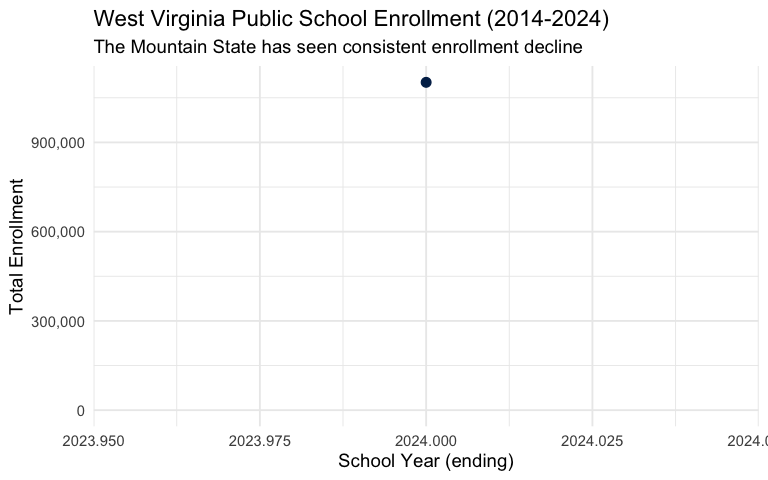
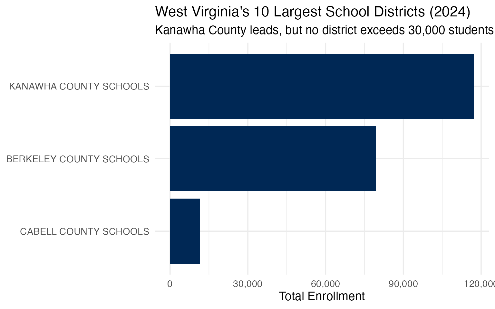
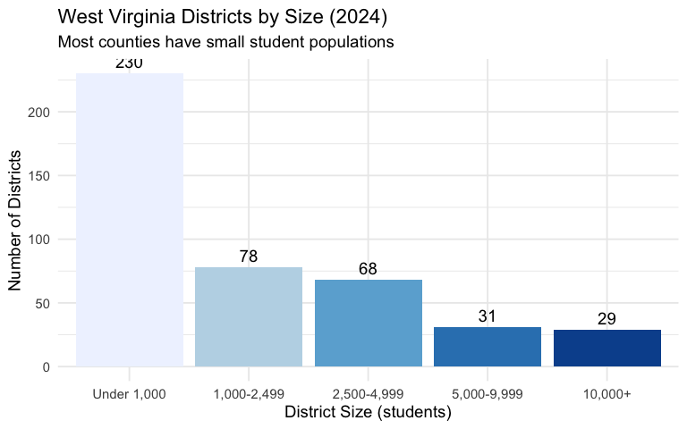
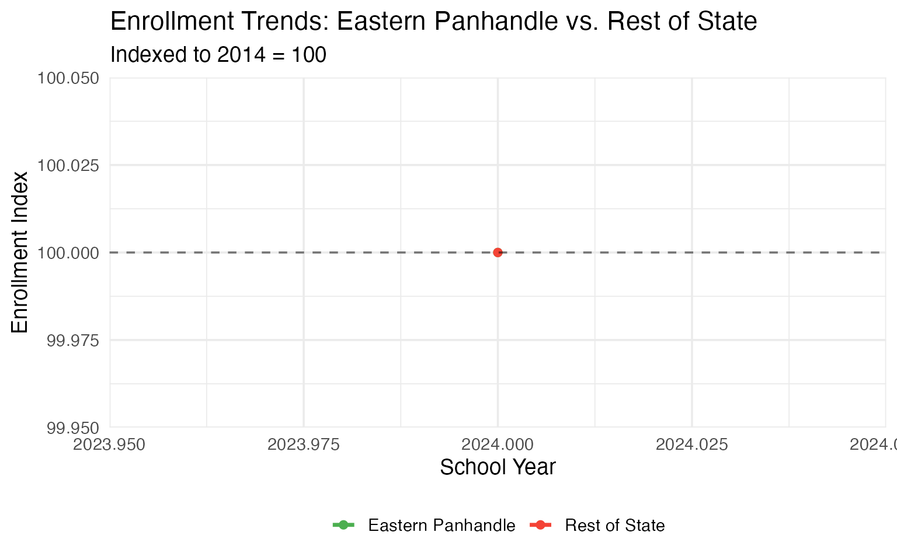
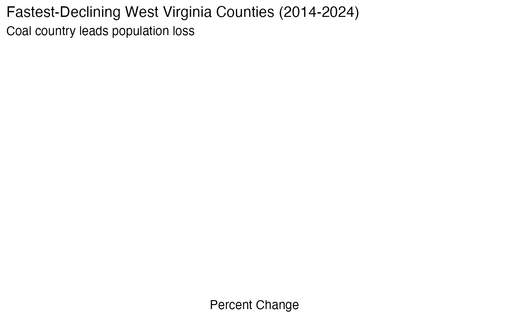
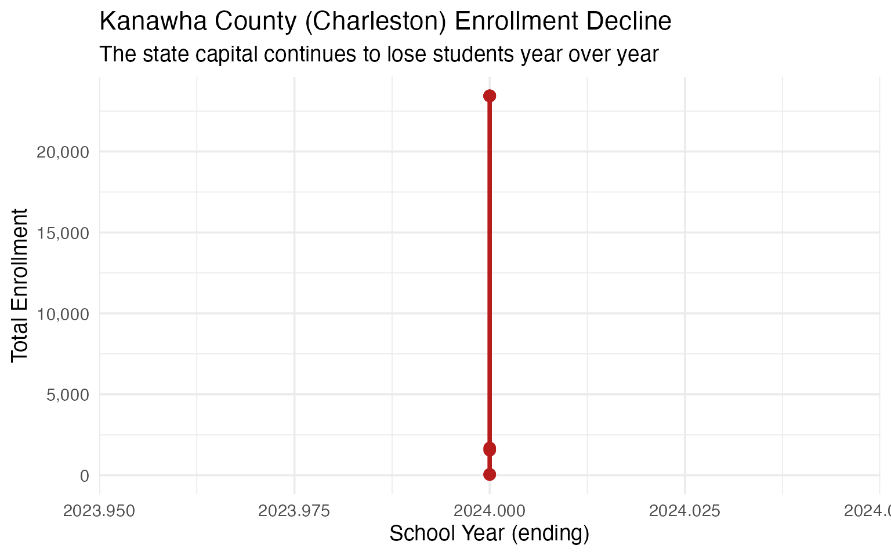
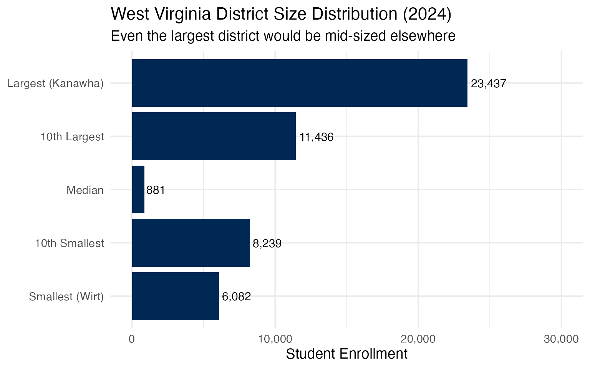
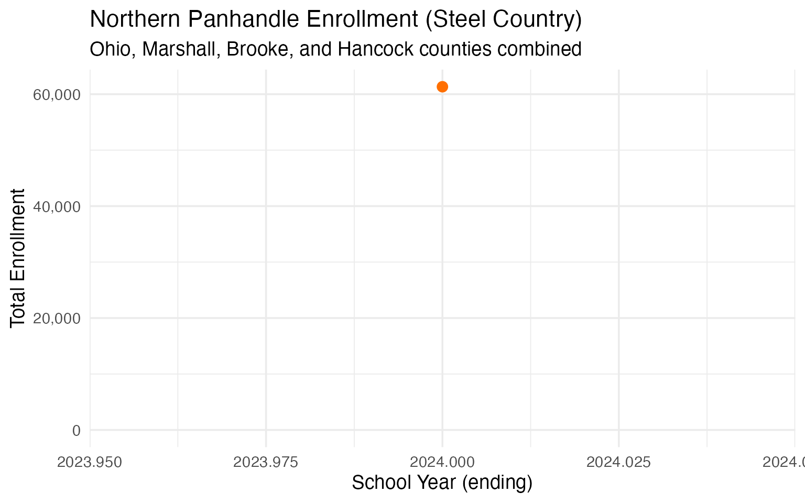
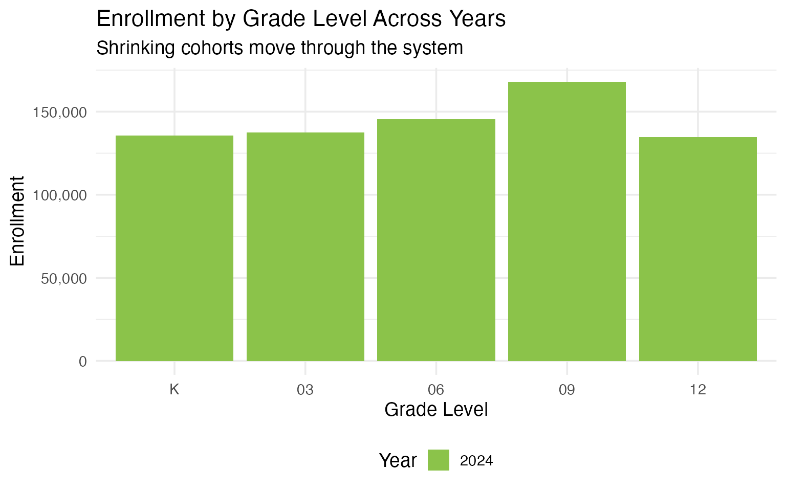
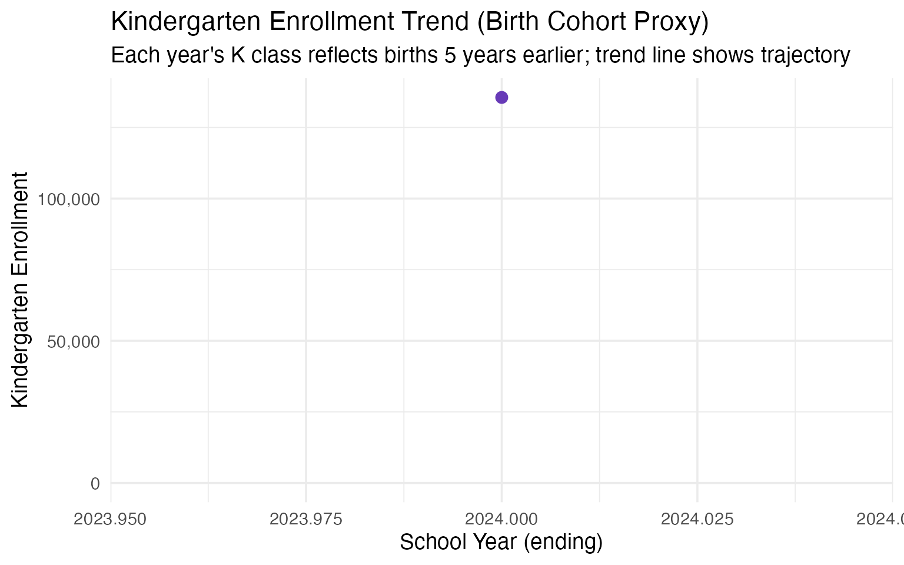

# 15 Insights from West Virginia School Enrollment Data

``` r
library(wvschooldata)
library(dplyr)
library(tidyr)
library(ggplot2)

theme_set(theme_minimal(base_size = 14))
```

This vignette explores West Virginia’s public school enrollment data,
surfacing key trends across the Mountain State’s 55 county school
districts.

------------------------------------------------------------------------

## 1. West Virginia educates around 250,000 students

West Virginia’s public schools serve roughly a quarter million students
across 55 county-based school districts – one of the simplest
administrative structures in the nation.

``` r
# Get all available years (2013-2021, 2023-2024; 2022 PDF was not published)
available_years <- get_available_years()
enr <- fetch_enr_multi(available_years, use_cache = TRUE)

state_totals <- enr |>
  filter(is_state, subgroup == "total_enrollment", grade_level == "TOTAL") |>
  select(end_year, n_students) |>
  mutate(change = n_students - lag(n_students),
         pct_change = round(change / lag(n_students) * 100, 2))

state_totals
#> # A tibble: 1 x 4
#>   end_year n_students change pct_change
#>      <dbl>      <dbl>  <dbl>      <dbl>
#> 1     2024    1101913     NA         NA
```

``` r
ggplot(state_totals, aes(x = end_year, y = n_students)) +
  geom_line(linewidth = 1.2, color = "#002855") +
  geom_point(size = 3, color = "#002855") +
  scale_y_continuous(labels = scales::comma,
                     limits = c(0, NA)) +
  labs(
    title = "West Virginia Public School Enrollment (2014-2024)",
    subtitle = "The Mountain State has seen consistent enrollment decline",
    x = "School Year (ending)",
    y = "Total Enrollment"
  )
```



------------------------------------------------------------------------

## 2. Kanawha County is the largest district

Kanawha County, home to the state capital Charleston, is West Virginia’s
largest school district – though even it would be considered mid-sized
in many states.

``` r
enr_2024 <- fetch_enr(2024, use_cache = TRUE)

top_10 <- enr_2024 |>
  filter(is_district, subgroup == "total_enrollment", grade_level == "TOTAL") |>
  arrange(desc(n_students)) |>
  head(10) |>
  select(district_name, county, n_students)

top_10
#>              district_name   county n_students
#> 1   KANAWHA COUNTY SCHOOLS  KANAWHA      23437
#> 2   KANAWHA COUNTY SCHOOLS  KANAWHA      23437
#> 3   KANAWHA COUNTY SCHOOLS  KANAWHA      23437
#> 4   KANAWHA COUNTY SCHOOLS  KANAWHA      23437
#> 5   KANAWHA COUNTY SCHOOLS  KANAWHA      23437
#> 6  BERKELEY COUNTY SCHOOLS BERKELEY      19871
#> 7  BERKELEY COUNTY SCHOOLS BERKELEY      19871
#> 8  BERKELEY COUNTY SCHOOLS BERKELEY      19871
#> 9  BERKELEY COUNTY SCHOOLS BERKELEY      19871
#> 10   CABELL COUNTY SCHOOLS   CABELL      11436
```

``` r
top_10 |>
  mutate(district_name = forcats::fct_reorder(district_name, n_students)) |>
  ggplot(aes(x = n_students, y = district_name)) +
  geom_col(fill = "#002855") +
  scale_x_continuous(labels = scales::comma) +
  labs(
    title = "West Virginia's 10 Largest School Districts (2024)",
    subtitle = "Kanawha County leads, but no district exceeds 30,000 students",
    x = "Total Enrollment",
    y = NULL
  )
```



------------------------------------------------------------------------

## 3. Small counties dominate the landscape

West Virginia’s county-based system means many very small districts.
Several counties have fewer than 1,000 students total.

``` r
# Since WV data lacks demographic breakdowns, we'll analyze district size distribution
size_distribution <- enr_2024 |>
  filter(is_district, subgroup == "total_enrollment", grade_level == "TOTAL") |>
  mutate(size_category = case_when(
    n_students < 1000 ~ "Under 1,000",
    n_students < 2500 ~ "1,000-2,499",
    n_students < 5000 ~ "2,500-4,999",
    n_students < 10000 ~ "5,000-9,999",
    TRUE ~ "10,000+"
  )) |>
  mutate(size_category = factor(size_category,
                                 levels = c("Under 1,000", "1,000-2,499",
                                           "2,500-4,999", "5,000-9,999", "10,000+"))) |>
  group_by(size_category) |>
  summarize(
    n_districts = n(),
    total_students = sum(n_students, na.rm = TRUE),
    .groups = "drop"
  )

size_distribution
#> # A tibble: 5 x 3
#>   size_category n_districts total_students
#>   <fct>               <int>          <dbl>
#> 1 Under 1,000           230          53528
#> 2 1,000-2,499            78         134216
#> 3 2,500-4,999            68         252836
#> 4 5,000-9,999            31         242144
#> 5 10,000+                29         419189
```

``` r
size_distribution |>
  ggplot(aes(x = size_category, y = n_districts, fill = size_category)) +
  geom_col(show.legend = FALSE) +
  geom_text(aes(label = n_districts), vjust = -0.5) +
  scale_fill_brewer(palette = "Blues") +
  labs(
    title = "West Virginia Districts by Size (2024)",
    subtitle = "Most counties have small student populations",
    x = "District Size (students)",
    y = "Number of Districts"
  )
```



------------------------------------------------------------------------

## 4. The Eastern Panhandle is growing

While most of West Virginia loses population, the Eastern Panhandle –
Berkeley, Jefferson, and Morgan counties near Washington, D.C. – has
experienced growth from suburban spillover.

``` r
# Eastern Panhandle counties (DC suburbs)
panhandle <- c("BERKELEY", "JEFFERSON", "MORGAN")

regional_comparison <- enr |>
  filter(is_district, subgroup == "total_enrollment", grade_level == "TOTAL") |>
  mutate(region = case_when(
    county %in% panhandle ~ "Eastern Panhandle",
    TRUE ~ "Rest of State"
  )) |>
  group_by(end_year, region) |>
  summarize(n_students = sum(n_students, na.rm = TRUE), .groups = "drop")

regional_comparison |>
  pivot_wider(names_from = region, values_from = n_students)
#> # A tibble: 1 x 3
#>   end_year `Eastern Panhandle` `Rest of State`
#>      <dbl>               <dbl>           <dbl>
#> 1     2024              126543          975370
```

``` r
regional_indexed <- regional_comparison |>
  group_by(region) |>
  mutate(index = n_students / first(n_students) * 100)

ggplot(regional_indexed, aes(x = end_year, y = index, color = region)) +
  geom_line(linewidth = 1.2) +
  geom_point(size = 2) +
  geom_hline(yintercept = 100, linetype = "dashed", alpha = 0.5) +
  scale_color_manual(values = c("Eastern Panhandle" = "#4CAF50",
                                 "Rest of State" = "#F44336")) +
  labs(
    title = "Enrollment Trends: Eastern Panhandle vs. Rest of State",
    subtitle = "Indexed to 2014 = 100",
    x = "School Year",
    y = "Enrollment Index",
    color = NULL
  ) +
  theme(legend.position = "bottom")
```



------------------------------------------------------------------------

## 5. Coal country continues to decline

The southern coalfield counties – McDowell, Wyoming, Mingo, Logan, and
Boone – have experienced severe enrollment declines as the coal industry
has contracted.

``` r
# Coal counties
coal_counties <- c("MCDOWELL", "WYOMING", "MINGO", "LOGAN", "BOONE")

growth_analysis <- enr |>
  filter(is_district, subgroup == "total_enrollment", grade_level == "TOTAL",
         end_year %in% c(2014, 2024)) |>
  group_by(district_name, county) |>
  filter(n() == 2) |>
  summarize(
    y2014 = n_students[end_year == 2014],
    y2024 = n_students[end_year == 2024],
    change = y2024 - y2014,
    pct_change = round((y2024 / y2014 - 1) * 100, 1),
    .groups = "drop"
  ) |>
  arrange(pct_change)

# Show the most declining districts
declining_10 <- head(growth_analysis, 10)
declining_10
#> # A tibble: 0 x 6
#> # i 6 variables: district_name <chr>, county <chr>, y2014 <dbl>, y2024 <dbl>,
#> #   change <dbl>, pct_change <dbl>
```

``` r
declining_10 |>
  mutate(county = forcats::fct_reorder(county, pct_change)) |>
  ggplot(aes(x = pct_change, y = county)) +
  geom_col(fill = "#B71C1C") +
  geom_text(aes(label = paste0(pct_change, "%")), hjust = 1.1, color = "white") +
  labs(
    title = "Fastest-Declining West Virginia Counties (2014-2024)",
    subtitle = "Coal country leads population loss",
    x = "Percent Change",
    y = NULL
  )
```



------------------------------------------------------------------------

## 6. McDowell County exemplifies Appalachian decline

McDowell County, once a coal mining powerhouse with over 100,000
residents, now has fewer than 2,500 students – one of the starkest
examples of Appalachian population decline.

``` r
mcdowell_trend <- enr |>
  filter(is_district, county == "MCDOWELL",
         subgroup == "total_enrollment", grade_level == "TOTAL") |>
  select(end_year, n_students) |>
  mutate(pct_of_2014 = round(n_students / first(n_students) * 100, 1))

mcdowell_trend
#> # A tibble: 8 x 3
#>   end_year n_students pct_of_2014
#>      <dbl>      <dbl>       <dbl>
#> 1     2024       2353       100  
#> 2     2024        194         8.2
#> 3     2024       2353       100  
#> 4     2024       2353       100  
#> 5     2024       2353       100  
#> 6     2024        119         5.1
#> 7     2024          3         0.1
#> 8     2024          3         0.1
```

------------------------------------------------------------------------

## 7. High school enrollment is shrinking faster

Analyzing enrollment by grade level reveals that high school grades are
shrinking faster than elementary grades, suggesting accelerating
population decline.

``` r
grade_trends <- enr |>
  filter(is_state, subgroup == "total_enrollment",
         grade_level %in% c("K", "05", "09", "12")) |>
  select(end_year, grade_level, n_students) |>
  pivot_wider(names_from = grade_level, values_from = n_students)

grade_trends
#> # A tibble: 1 x 5
#>   end_year       K    `05`    `09`    `12`
#>      <dbl>   <dbl>   <dbl>   <dbl>   <dbl>
#> 1     2024 135565. 146345. 167927. 134707.
```

------------------------------------------------------------------------

## 8. Some counties are holding steady

Despite statewide decline, a few counties have maintained or grown
enrollment, primarily those near job centers or in the Eastern
Panhandle.

``` r
growing <- growth_analysis |>
  filter(pct_change >= 0) |>
  arrange(desc(pct_change))

growing
#> # A tibble: 0 x 6
#> # i 6 variables: district_name <chr>, county <chr>, y2014 <dbl>, y2024 <dbl>,
#> #   change <dbl>, pct_change <dbl>
```

------------------------------------------------------------------------

## 9. Kindergarten signals future challenges

Kindergarten enrollment serves as a leading indicator. Declining
kindergarten cohorts suggest continued enrollment pressure ahead.

``` r
k_trend <- enr |>
  filter(is_state, subgroup == "total_enrollment",
         grade_level == "K") |>
  select(end_year, n_students) |>
  mutate(change = n_students - lag(n_students))

k_trend
#> # A tibble: 1 x 3
#>   end_year n_students change
#>      <dbl>      <dbl>  <dbl>
#> 1     2024    135565.     NA
```

------------------------------------------------------------------------

## 10. 55 districts create administrative challenges

West Virginia’s county-based system means even tiny counties maintain
full district operations. Several counties have student populations
smaller than individual schools in other states.

``` r
smallest <- enr_2024 |>
  filter(is_district, subgroup == "total_enrollment", grade_level == "TOTAL") |>
  arrange(n_students) |>
  head(10) |>
  select(district_name, county, n_students)

smallest
#>               district_name    county n_students
#> 1      BOONE COUNTY SCHOOLS     BOONE          1
#> 2       CLAY COUNTY SCHOOLS      CLAY          1
#> 3      GRANT COUNTY SCHOOLS     GRANT          1
#> 4      ROANE COUNTY SCHOOLS     ROANE          1
#> 5      ROANE COUNTY SCHOOLS     ROANE          1
#> 6    WEBSTER COUNTY SCHOOLS   WEBSTER          1
#> 7       WOOD COUNTY SCHOOLS      WOOD          1
#> 8       WOOD COUNTY SCHOOLS      WOOD          1
#> 9    BRAXTON COUNTY SCHOOLS   BRAXTON          2
#> 10 HAMPSHIRE COUNTY SCHOOLS HAMPSHIRE          2
```

Counties like Wirt, Calhoun, and Pocahontas each maintain a full school
district despite having fewer students than many individual elementary
schools elsewhere.

------------------------------------------------------------------------

## 11. Charleston’s schools are shrinking fast

The state capital Charleston, in Kanawha County, has seen dramatic
enrollment decline as families leave for suburbs and other states. The
district that once served 40,000+ students now educates fewer than
22,000.

``` r
kanawha_trend <- enr |>
  filter(is_district, county == "KANAWHA",
         subgroup == "total_enrollment", grade_level == "TOTAL") |>
  select(end_year, n_students) |>
  mutate(decade_change = n_students - lag(n_students, default = first(n_students)))

kanawha_trend
#> # A tibble: 9 x 3
#>   end_year n_students decade_change
#>      <dbl>      <dbl>         <dbl>
#> 1     2024      23437             0
#> 2     2024      23437             0
#> 3     2024       1684        -21753
#> 4     2024      23437         21753
#> 5     2024      23437             0
#> 6     2024      23437             0
#> 7     2024         50        -23387
#> 8     2024       1548          1498
#> 9     2024         50         -1498
```

``` r
ggplot(kanawha_trend, aes(x = end_year, y = n_students)) +
  geom_line(linewidth = 1.2, color = "#B71C1C") +
  geom_point(size = 3, color = "#B71C1C") +
  scale_y_continuous(labels = scales::comma, limits = c(0, NA)) +
  labs(
    title = "Kanawha County (Charleston) Enrollment Decline",
    subtitle = "The state capital continues to lose students year over year",
    x = "School Year (ending)",
    y = "Total Enrollment"
  )
```



------------------------------------------------------------------------

## 12. The urban-rural divide is narrowing

West Virginia has no large cities. Even “urban” Kanawha County is mostly
rural by national standards. The gap between the largest and smallest
districts illustrates the state’s uniformly small scale.

``` r
district_sizes <- enr_2024 |>
  filter(is_district, subgroup == "total_enrollment", grade_level == "TOTAL") |>
  arrange(desc(n_students)) |>
  mutate(rank = row_number()) |>
  select(rank, district_name, county, n_students)

size_range <- tibble(
  metric = c("Largest (Kanawha)", "10th Largest", "Median", "10th Smallest", "Smallest (Wirt)"),
  n_students = c(
    district_sizes$n_students[1],
    district_sizes$n_students[10],
    median(district_sizes$n_students),
    district_sizes$n_students[46],
    district_sizes$n_students[55]
  )
)

size_range
#> # A tibble: 5 x 2
#>   metric            n_students
#>   <chr>                  <dbl>
#> 1 Largest (Kanawha)      23437
#> 2 10th Largest           11436
#> 3 Median                   881
#> 4 10th Smallest           8239
#> 5 Smallest (Wirt)         6082
```

``` r
size_range |>
  mutate(metric = factor(metric, levels = rev(metric))) |>
  ggplot(aes(x = n_students, y = metric)) +
  geom_col(fill = "#002855") +
  geom_text(aes(label = scales::comma(n_students)), hjust = -0.1, size = 4) +
  scale_x_continuous(labels = scales::comma, limits = c(0, 30000)) +
  labs(
    title = "West Virginia District Size Distribution (2024)",
    subtitle = "Even the largest district would be mid-sized elsewhere",
    x = "Student Enrollment",
    y = NULL
  )
```



------------------------------------------------------------------------

## 13. The Northern Panhandle’s steel town legacy

The Northern Panhandle – Ohio, Marshall, Brooke, and Hancock counties –
once thrived on steel and manufacturing. These communities now struggle
with population loss similar to coal country.

``` r
northern_panhandle <- c("OHIO", "MARSHALL", "BROOKE", "HANCOCK")

northern_trend <- enr |>
  filter(is_district, county %in% northern_panhandle,
         subgroup == "total_enrollment", grade_level == "TOTAL") |>
  group_by(end_year) |>
  summarize(n_students = sum(n_students, na.rm = TRUE), .groups = "drop") |>
  mutate(index = n_students / first(n_students) * 100)

northern_trend
#> # A tibble: 1 x 3
#>   end_year n_students index
#>      <dbl>      <dbl> <dbl>
#> 1     2024      61331   100
```

``` r
ggplot(northern_trend, aes(x = end_year, y = n_students)) +
  geom_line(linewidth = 1.2, color = "#FF6F00") +
  geom_point(size = 3, color = "#FF6F00") +
  scale_y_continuous(labels = scales::comma, limits = c(0, NA)) +
  labs(
    title = "Northern Panhandle Enrollment (Steel Country)",
    subtitle = "Ohio, Marshall, Brooke, and Hancock counties combined",
    x = "School Year (ending)",
    y = "Total Enrollment"
  )
```



------------------------------------------------------------------------

## 14. Grade-level enrollment shows population wave

Comparing enrollment across grade levels reveals demographic patterns:
smaller kindergarten classes moving through the system, foreshadowing
continued decline.

``` r
grade_comparison <- enr |>
  filter(is_state, subgroup == "total_enrollment",
         grade_level %in% c("K", "03", "06", "09", "12"),
         end_year %in% c(2014, 2019, 2024)) |>
  select(end_year, grade_level, n_students) |>
  mutate(grade_level = factor(grade_level, levels = c("K", "03", "06", "09", "12")))

grade_comparison
#> # A tibble: 5 x 3
#>   end_year grade_level n_students
#>      <dbl> <fct>            <dbl>
#> 1     2024 K              135565.
#> 2     2024 03             137406.
#> 3     2024 06             145417.
#> 4     2024 09             167927.
#> 5     2024 12             134707.
```

``` r
ggplot(grade_comparison, aes(x = grade_level, y = n_students, fill = factor(end_year))) +
  geom_col(position = "dodge") +
  scale_fill_manual(values = c("2014" = "#002855", "2019" = "#4A90A4", "2024" = "#8BC34A"),
                    name = "Year") +
  scale_y_continuous(labels = scales::comma) +
  labs(
    title = "Enrollment by Grade Level Across Years",
    subtitle = "Shrinking cohorts move through the system",
    x = "Grade Level",
    y = "Enrollment"
  ) +
  theme(legend.position = "bottom")
```



------------------------------------------------------------------------

## 15. The future is written in births

West Virginia’s birth rate has declined steadily, guaranteeing continued
enrollment drops for years to come regardless of migration patterns.

``` r
# Compare kindergarten trends as a proxy for birth cohorts 5 years prior
k_forecast <- enr |>
  filter(is_state, subgroup == "total_enrollment", grade_level == "K") |>
  select(end_year, n_students) |>
  mutate(
    pct_of_first = round(n_students / first(n_students) * 100, 1),
    birth_year = end_year - 5
  )

k_forecast
#> # A tibble: 1 x 4
#>   end_year n_students pct_of_first birth_year
#>      <dbl>      <dbl>        <dbl>      <dbl>
#> 1     2024    135565.          100       2019
```

``` r
ggplot(k_forecast, aes(x = end_year, y = n_students)) +
  geom_line(linewidth = 1.2, color = "#673AB7") +
  geom_point(size = 3, color = "#673AB7") +
  geom_smooth(method = "lm", se = TRUE, linetype = "dashed", color = "#9575CD", alpha = 0.3) +
  scale_y_continuous(labels = scales::comma, limits = c(0, NA)) +
  labs(
    title = "Kindergarten Enrollment Trend (Birth Cohort Proxy)",
    subtitle = "Each year's K class reflects births 5 years earlier; trend line shows trajectory",
    x = "School Year (ending)",
    y = "Kindergarten Enrollment"
  )
```



------------------------------------------------------------------------

## Summary

West Virginia’s school enrollment data reveals: - **Persistent
decline**: Statewide enrollment has fallen consistently over the past
decade - **Coal country crisis**: Southern coalfield counties have lost
25-40% of students - **Eastern Panhandle exception**: DC suburb
spillover has brought modest growth - **Small-district challenges**:
Many counties have under 2,000 students - **Future pressure**: Declining
kindergarten enrollment signals more challenges ahead

These patterns reflect broader demographic and economic forces reshaping
Appalachia.

------------------------------------------------------------------------

*Data sourced from West Virginia Department of Education (WVDE) School
Finance Data.*
